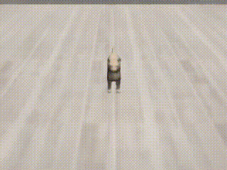
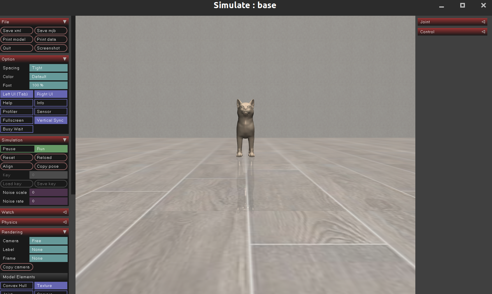
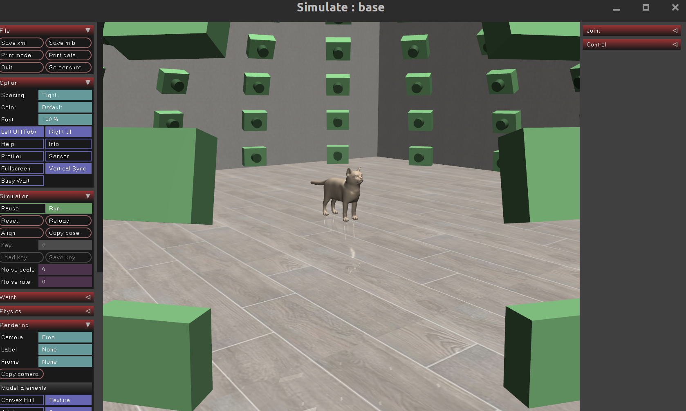
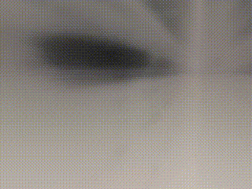
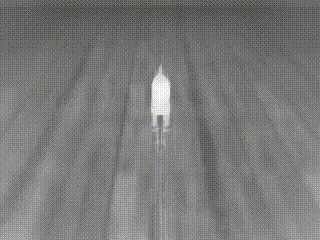
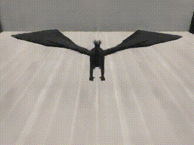
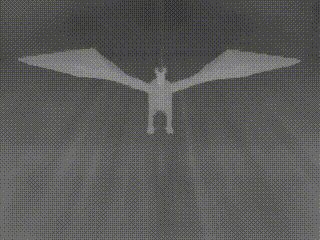
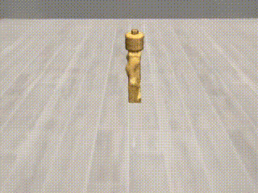
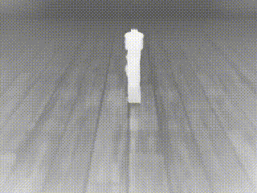

# mujoNeRF



Pytorch implementation of Neural Radiance Field using MuJoCo environment generated dataset

mujoNeRF can easily synthesis novel views of several mesh objects in MuJoCo environment

MuJoCo environment is based on [robosuite](https://robosuite.ai/), and NeRF code is fully based on [nerf-pytorch](https://github.com/yenchenlin/nerf-pytorch)

## Installation

```
$ git clone https://github.com/volunt4s/mujoNeRF
$ cd mujoNeRF
$ pip install -r requirements.txt
```

## Dependencies


- Pytorch 1.4
- mujoco (≥ 2.0)
- dm_control
- numpy
- imageio
- imageio-ffmpeg
- configargparse
- tqdm

## How to run?


To optimize mujoNeRF, you need to follow several steps

### 1. Generate MuJoCo based dataset

Firstly, run MuJoCo gui and get camera reference pose corresponding to the one side of the object using Rendering → ‘Copy camera’ button in gui


```
$ python generate_nerf_data.py --run_gui True
```

- Since mujoNeRF generates camera samples with z(azimuth), y(elevation)-axis transforms to satisfy spherical poses, it is recommended to select the lower part of the object as a reference camera. See example image below



(Optional) To check generated camera pose in gui, run the code below

```
$ python generate_nerf_data.py --run_gui True --cam_xml '{copied camera xml here}'
```



Once you have obtained the reference camera pose, run the code below to create the image dataset and transform.json file.

Datasets, transform.json file will be create at `mujoNeRF/nerf_data`

```
$ python generate_nerf_data.py --generate True --cam_xml '{copied camera xml here}'
```

### 2. Optimize NeRF

Modify the `config.txt` file for your experiment.

To train NeRF, run the code below.

```
$ python run_nerf --config config.txt
```

Training takes about 10 minutes using single RTX 3080 GPU.

After training, the trained model is stored at `logs/{expname}/`

### 3. Save RGB, Depth video

Save the reference image ID(video_ref_id) in `config.txt` to generate the image from the generated `mujoNeRF/nerf_data`.

Videos will be save at `logs/{expname}/rendered/`

```
$ python save_video.py --config config.txt
```
Training procedure animation below




## Custom objects

Since mujoNeRF add objects using mjcf files, you can add your custom object mesh files. Place object mesh file(.stl), mjcf file, textures according to the following directory structure and modify `objects/xml_objects.py`

```                                                                                        
├── mjmodels                                                                                                 
│   ├── assets
│   │   └── objects        # mesh file (.stl) and mjcf file (.xml)
│   │   └── textures       # texture file (.png)
|   ├── objects
|   |   └── xml_objects.py # add your custom object 
```

## Results

### Cat
<table border="0">
 <tr>
    <td align="center"><b style="font-size:15px">RGB</b></td>
    <td align="center"><b style="font-size:15px">Depth</b></td>
 </tr>
 <tr>
    <td></td>
    <td></td>
 </tr>
</table>

### Dragon
<table border="0">
 <tr>
    <td align="center"><b style="font-size:15px">RGB</b></td>
    <td align="center"><b style="font-size:15px">Depth</b></td>
 </tr>
 <tr>
    <td></td>
    <td></td>
 </tr>
</table>

### Lego
<table border="0">
 <tr>
    <td align="center"><b style="font-size:15px">RGB</b></td>
    <td align="center"><b style="font-size:15px">Depth</b></td>
 </tr>
 <tr>
    <td></td>
    <td></td>
 </tr>
</table>

Enjoy!